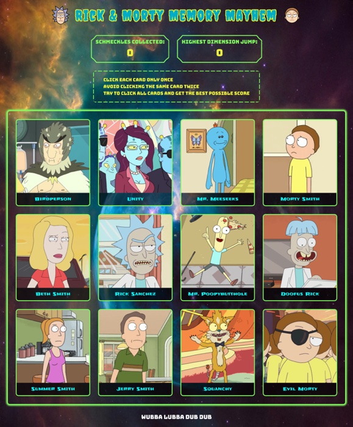
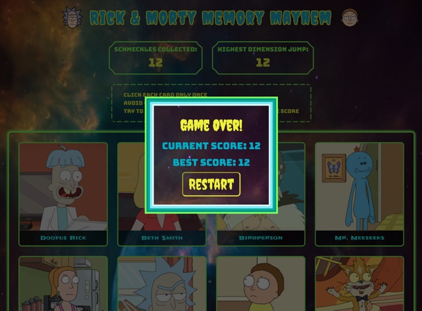
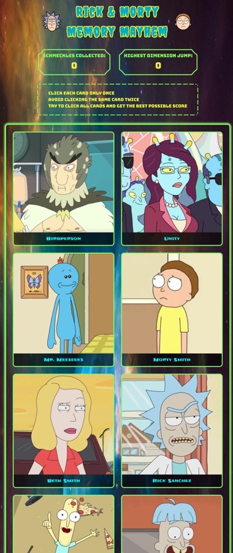
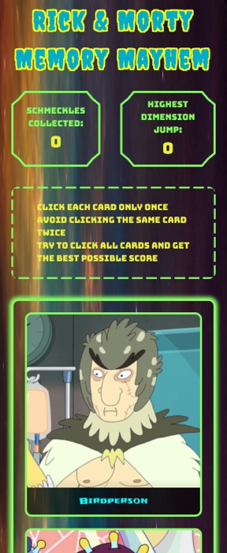

# Memory Card Project (The Odin Project)

This is a solution to the [Memory Card Project](https://www.theodinproject.com/lessons/node-path-react-new-memory-card) as part of The Odin Project curriculum. 

## Table of contents

- [Memory Card Project (The Odin Project)](#memory-card-project-the-odin-project)
  - [Table of contents](#table-of-contents)
  - [Overview](#overview)
    - [Screenshots](#screenshots)
    - [Links](#links)
  - [Acknowledgments](#acknowledgments)
    - [Images](#images)
    - [Icons](#icons)
    - [Fonts](#fonts)
    - [Useful resources](#useful-resources)

## Overview

This project is a variation on popular memory game called "Concentration". The goal of this project is to create a simple and responsive memory card game using React and CSS. Rules of the game are simple: the player has to click on all the cards exactly once without repeating a card. With each click on a card, the player gets one point. The goal of the game is to get the highest score possible. The player wins the game when all the cards are clicked. 

### Screenshots

<table>
  <tr>
    <td align="center">
      
       
      <em>Desktop View</em>
    </td>
    <td align="center">
      
       
      <em>Desktop View with Dialog Modal</em>
    </td>
  </tr>
  <tr>
    <td align="center">
      
       
      <em>Tablet View</em>
    </td>
    <td align="center">
      
       
      <em>Mobile View</em>
    </td>
  </tr>
</table>

### Links

- [Solution URL](https://github.com/py-code314/memory-card)
- [Live Site URL](https://chicken-run-memory-card.netlify.app/)

## Acknowledgments

### Images

- Background image "Bubble Nebula (NGC 7635)" by NASA Hubble Space Telescope on [Unsplash](https://unsplash.com/photos/a-large-blue-bubble-in-the-middle-of-a-space-filled-with-stars-k20fpgVfoPE)
- Card images are from [rickandmortyapi.com](https://rickandmortyapi.com/)

### Icons

- Rick icon from [icons8.com](https://icons8.com/icon/udMvpkRHbzzS/rick-sanchez)
- Morty icon from [icons8.com](https://icons8.com/icon/hAPVXSp7TpSM/morty-smith)

### Fonts

- All fonts are from [Google Fonts](https://fonts.google.com/)

### Useful resources

- Custom CSS borders: [kovart.github.io](https://kovart.github.io/dashed-border-generator/)
- Custom border corners: [css-generators.com](https://css-generators.com/custom-corners/)
- Spinner animation: [css-loaders.com](https://css-loaders.com/spinner/)
- Text shadow: [cssportal.com](https://www.cssportal.com/css3-text-shadow-generator/)

